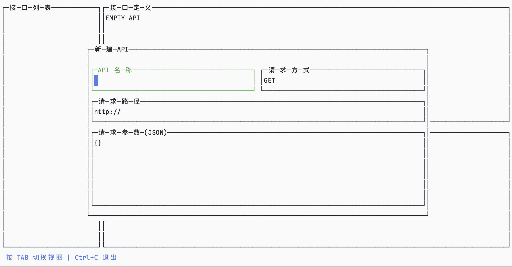
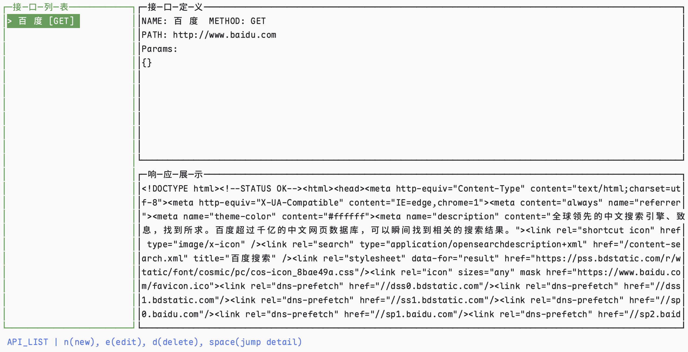

# Lazyapi

从 [lazygit](https://github.com/jesseduffield/lazygit) 中受到启发，并且无法忍受现有的Api管理工具的启动速度慢。
操作繁琐等问题，希望能在命令行中快速管理请求并进行发送查看

## Feature

1. Api的增删改查

2. Api请求发送，暂支持Get/Post请求，可配置请求体信息（统一使用Json），并展示响应内容

3. 不同的区域有不同的快捷键
   1. 接口列表提供：新建，编辑，删除，详情跳转
   2. 接口定义提供：请求发送
   3. 响应展示提供：复制到剪切板，通过上下来查看完整响应内容
4. 通过Sqlite支持Api的存储与读取

## 待改进

1. 底层使用[gocui](https://github.com/jroimartin/gocui) 对中文支持不好，目前我fork了一个版本，并临时解决了中文输入与展示问题。但是对于光标移动和字符删除仍有问题。比如删除上一个字符，则需要按两下删除键，才能把字符完整删除掉，光标移动也是类似的。英文使用无误。后期待修改
1. 暂时仅支持Get和Post请求，后续会加上其他请求方式，并增加Header的设置
1. 需要能通过SwaggerUrl快速导入Api数据，可快速上手
1. 需要有请求记录的概念，允许请求重放，查看历史请求信息
1. 性能待优化

## 使用方式

下载代码后执行：`go build` 得到对应的可执行文件
