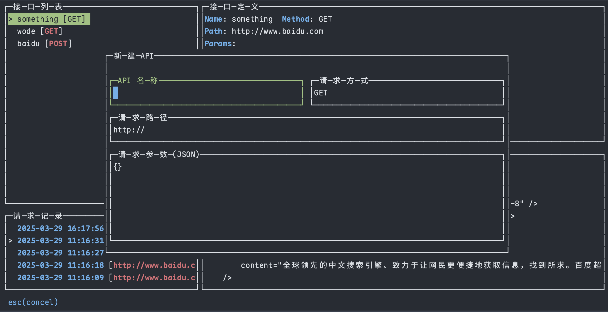
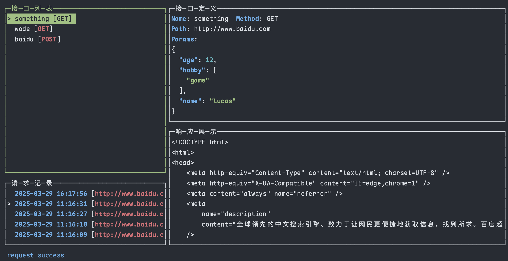

# Lazyapi

Inspired by [lazygit](https://github.com/jesseduffield/lazygit), Lazyapi aims to solve the slow startup and cumbersome operation issues of existing API management tools, allowing you to quickly manage API requests and view responses from the command line.

[中文文档](./README.zh-CN.md)

## Features

1. CRUD operations for APIs

2. Send API requests with support for GET/POST methods, configurable request body (JSON format), and response display

3. Local data storage using SQLite

   For Mac users, the lazyapi.db file is generated in the ~/Library/Application Support/lazyapi directory. Database versioning is managed with [goose](https://github.com/pressly/goose), automatically executing all migration files in the migrations directory when new versions add new fields.

## Keyboard Shortcuts

### API List View (API_LIST)
- `n` - Create new API
- `e` - Edit API
- `d` - Delete API
- `r` - Send request
- `space` - View details
- `tab` - Switch views (between API list and request record list)
- `g` - Quick GET request
- `p` - Quick POST request

### API Details View (API_INFO)
- `↑` - Scroll up
- `↓` - Scroll down
- `esc` - Return to list

### Response Info View (RESPOND_INFO)
- `↑` - Scroll up
- `↓` - Scroll down
- `esc` - Return to list

### Request Confirmation View (REQUEST_CONFIRM_VIEW)
- `ctrl-r` - Confirm
- `ctrl-q` - Cancel

### Record List View (RECORD_LIST)
- `d` - Delete record
- `space` - View details
- `tab` - Switch views
- `g` - Quick GET request
- `p` - Quick POST request

### API Creation and Editing View
- `esc` - Cancel

When writing JSON, use `ctrl-f` to format the content

## Future Improvements

1. The underlying [gocui](https://github.com/jroimartin/gocui) library has limited Chinese language support. I've forked a version with temporary fixes for Chinese input and display, but cursor movement and character deletion still have issues (deleting Chinese characters requires pressing the delete key twice, with similar issues for cursor movement). No such problems with English.
2. Currently only supports GET and POST requests. Planning to add other request methods and header configuration.
3. Planning to add the ability to quickly import API data via Swagger URL.
4. Add more configuration options.

## Usage

Download the code and run: `go build` to get the executable file
