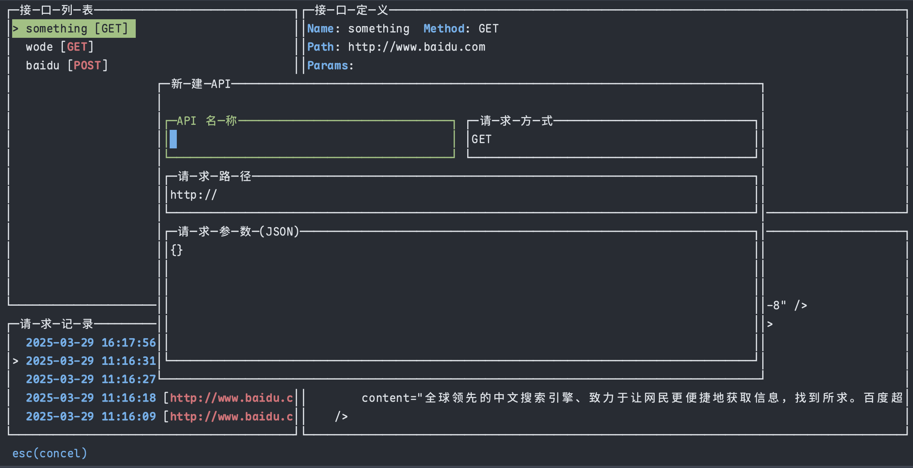
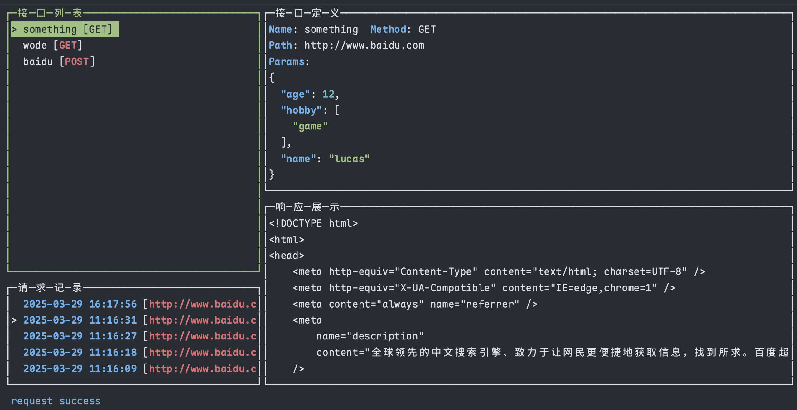

# Lazyapi

从 [lazygit](https://github.com/jesseduffield/lazygit) 中受到启发，Lazyapi 旨在解决现有API管理工具启动慢、操作繁琐的问题，让您能够在命令行中快速管理API请求并查看响应。

## 功能特点

1. API的增删改查

2. API请求发送，支持GET/POST请求，可配置请求体（JSON格式），并展示响应内容

3. 本地数据存储，使用SQLite

   Mac用户会在 ~/Library/Application Support/lazyapi 目录下生成lazyapi.db文件。使用[goose](https://github.com/pressly/goose)管理数据库版本，当新版本增加新字段时，程序会在启动时自动执行migrations目录下的所有迁移文件。

## 快捷键

### API 列表视图 (API_LIST)
- `n` - 创建新API
- `e` - 编辑API
- `d` - 删除API
- `r` - 发起请求
- `空格` - 查看详情
- `tab` - 切换视图(在API列表和请求记录列表间切换)
- `g` - 发起快速GET请求
- `p` - 发起快速POST请求

### API 详情视图 (API_INFO)
- `↑` - 向上翻页
- `↓` - 向下翻页
- `esc` - 返回列表

### 响应信息视图 (RESPOND_INFO)
- `↑` - 向上翻页
- `↓` - 向下翻页
- `esc` - 返回列表

### 请求确认视图 (REQUEST_CONFIRM_VIEW)
- `ctrl-r` - 确认
- `ctrl-q` - 取消

### 记录列表视图 (RECORD_LIST)
- `d` - 删除记录
- `空格` - 查看详情
- `tab` - 切换视图
- `g` - 快速GET请求
- `p` - 快速POST请求

### API新建和编辑视图
- `esc` - 取消

编写JSON信息时支持 `ctrl-f` 进行格式化

## 待改进

1. 底层使用[gocui](https://github.com/jroimartin/gocui)，对中文支持不佳。目前我fork了一个版本，临时解决了中文输入与展示问题，但光标移动和字符删除仍有问题（删除中文字符需按两次删除键，光标移动也有类似问题）。英文使用无此问题。
2. 目前仅支持GET和POST请求，后续会增加其他请求方式，并支持Header设置。
3. 计划添加通过Swagger URL快速导入API数据的功能。
4. 增加更多可配置项。

## 使用方式

下载代码后执行：`go build` 获取对应的可执行文件
